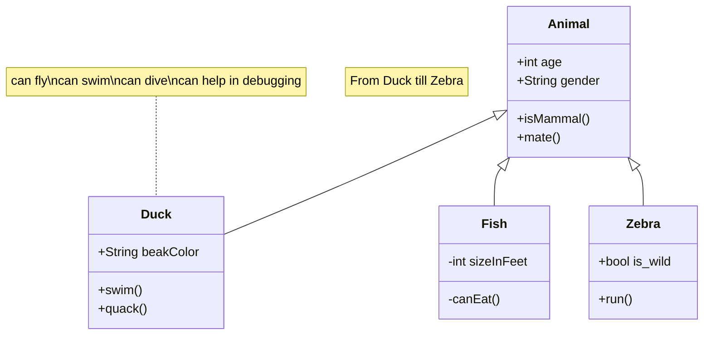
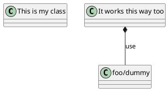

---
{"dg-publish":true,"dg-permalink":"/feater","permalink":"/feater/"}
---


## Wikilinks

Link as you normally would in Obisidan, with the `[[Wikilink]]` syntax

### Header links

Linking to a specific header works the same way as in Obsidian  
`[[My Note#Note header]]`

### Block links

Linking to a specific block works the same way as in Obsidian  
`[[My Note#^123abc]]`

### Custom link names

[[数字花园支持的功能/支持的功能#^c909cc\|测试双链]]


## Code Blocks


```javascript
let a = 5;
function tste () {
	let tset =1;
}
tste();
```

---

## Dataview queries

- [[毕设/GIT日志读取\|GIT日志读取]]
- [[毕设/Websocket\|Websocket]]
- [[毕设/大体框架.excalidraw\|大体框架.excalidraw]]
- [[毕设/实现\|实现]]

{ .block-language-dataview}


---

## Callouts


> [!NOTE] Note title
> Information


> [!WARNING] A warning
> This is a warning


### Folding Callouts


> [!NOTE]+ Open by default
> Folding/Collapsable callout


> [!FAQ]- Closed by default
> Folding/Collapsable callout


### Nested callouts

> [!TIP] Nested callouts
> Text inside the tip callout
> > [!EXAMPLE] Inner callout
> > Multiple nesting layers
> > > [!TODO] Inner inner callout{ #c909cc}


---

## MathJax / LaTex

```
$\frac{1}{0} = \infty$
```

10=∞

---

## Tags

Click on the tag below to view other pages with the same tag.

#exampletag

---

## Embedded/Transcluded Images


---

## Excalidraw

<style> .container {font-family: sans-serif; text-align: center;} .button-wrapper button {z-index: 1;height: 40px; width: 100px; margin: 10px;padding: 5px;} .excalidraw .App-menu_top .buttonList { display: flex;} .excalidraw-wrapper { height: 800px; margin: 50px; position: relative;} :root[dir="ltr"] .excalidraw .layer-ui__wrapper .zen-mode-transition.App-menu_bottom--transition-left {transform: none;} </style><script src="https://cdn.jsdelivr.net/npm/react@17/umd/react.production.min.js"></script><script src="https://cdn.jsdelivr.net/npm/react-dom@17/umd/react-dom.production.min.js"></script><script type="text/javascript" src="https://cdn.jsdelivr.net/npm/@excalidraw/excalidraw@0/dist/excalidraw.production.min.js"></script><div id="人工智能项目excalidraw.md1"></div><script>(function(){const InitialData={"type":"excalidraw","version":2,"source":"https://github.com/zsviczian/obsidian-excalidraw-plugin/releases/tag/2.2.9","elements":[{"type":"rectangle","version":8,"versionNonce":1715691788,"index":"a1","isDeleted":false,"id":"WBYXwR8aJnibegs8DS0cJ","fillStyle":"solid","strokeWidth":2,"strokeStyle":"solid","roughness":1,"opacity":100,"angle":0,"x":222.52242804632817,"y":-122.49146373844223,"strokeColor":"#1e1e1e","backgroundColor":"transparent","width":177.7624969482422,"height":217.5,"seed":1302705548,"groupIds":["sxbJvPY6Urhm9L8jPkcRC"],"frameId":null,"roundness":null,"boundElements":[{"id":"lUwiivJhDsImcFtjSKdtH","type":"arrow"},{"id":"c9jQ5stF3ssVVtH6J95b_","type":"arrow"},{"id":"hKwtr8xQXngILTJj7nCT-","type":"arrow"}],"updated":1720972904104,"link":null,"locked":false},{"type":"rectangle","version":7,"versionNonce":451413428,"index":"a2","isDeleted":false,"id":"PTrVjhRJoXNH71sIO25b5","fillStyle":"solid","strokeWidth":2,"strokeStyle":"solid","roughness":1,"opacity":100,"angle":0,"x":-358.31507347955073,"y":145.00853626155777,"strokeColor":"#1e1e1e","backgroundColor":"transparent","width":212.8249969482422,"height":181,"seed":1290740748,"groupIds":["ULN8bTvYt6QHJfWd22dZF"],"frameId":null,"roundness":null,"boundElements":[{"id":"lUwiivJhDsImcFtjSKdtH","type":"arrow"},{"id":"Xo_o6NKeKyNFLGXuC4A8v","type":"arrow"}],"updated":1720972904104,"link":null,"locked":false},{"type":"rectangle","version":6,"versionNonce":1808490380,"index":"a3","isDeleted":false,"id":"YwTVTmhTp1VHB4-EJcPwA","fillStyle":"solid","strokeWidth":2,"strokeStyle":"solid","roughness":1,"opacity":100,"angle":0,"x":114.04429389105474,"y":163.25853626155777,"strokeColor":"#1e1e1e","backgroundColor":"transparent","width":176.08750915527344,"height":144.5,"seed":772194956,"groupIds":["axe1RCteuWE75f6aEL135"],"frameId":null,"roundness":null,"boundElements":[{"id":"c9jQ5stF3ssVVtH6J95b_","type":"arrow"}],"updated":1720972904104,"link":null,"locked":false},{"type":"rectangle","version":6,"versionNonce":281358132,"index":"a4","isDeleted":false,"id":"qlp61UfjrsPxGHVf-mpqG","fillStyle":"solid","strokeWidth":2,"strokeStyle":"solid","roughness":1,"opacity":100,"angle":0,"x":340.1318030463282,"y":163.25853626155777,"strokeColor":"#1e1e1e","backgroundColor":"transparent","width":161.1750030517578,"height":144.5,"seed":2007404812,"groupIds":["N9lHXaeEJmRKV-K4s5gX9"],"frameId":null,"roundness":null,"boundElements":[{"id":"hKwtr8xQXngILTJj7nCT-","type":"arrow"}],"updated":1720972904104,"link":null,"locked":false},{"type":"rectangle","version":5,"versionNonce":751799820,"index":"a5","isDeleted":false,"id":"U7ia9jYsVysvDMFZdRIFa","fillStyle":"solid","strokeWidth":2,"strokeStyle":"dashed","roughness":1,"opacity":100,"angle":0,"x":-72.02757500542964,"y":-37.491463738442235,"strokeColor":"#1e1e1e","backgroundColor":"transparent","width":244.5500030517578,"height":47.5,"seed":1229492108,"groupIds":[],"frameId":null,"roundness":null,"boundElements":[{"type":"text","id":"nY8JQQXt"}],"updated":1720972904104,"link":null,"locked":false},{"type":"rectangle","version":6,"versionNonce":1950427316,"index":"a6","isDeleted":false,"id":"y3ilkJ1QSxOASOKOBAnNl","fillStyle":"solid","strokeWidth":2,"strokeStyle":"dashed","roughness":1,"opacity":100,"angle":0,"x":-381.77757500542964,"y":-86.24146373844223,"strokeColor":"#1e1e1e","backgroundColor":"transparent","width":259.75,"height":145,"seed":1126612492,"groupIds":[],"frameId":null,"roundness":null,"boundElements":[{"type":"text","id":"JBb59l2u"},{"id":"Xo_o6NKeKyNFLGXuC4A8v","type":"arrow"}],"updated":1720972904104,"link":null,"locked":false},{"type":"line","version":5,"versionNonce":1246358668,"index":"a7","isDeleted":false,"id":"tnrTHjjgmpDIWql4acv57","fillStyle":"solid","strokeWidth":1,"strokeStyle":"solid","roughness":1,"opacity":100,"angle":0,"x":222.52242804632817,"y":-77.99146373844223,"strokeColor":"#000","backgroundColor":"transparent","width":177.7624969482422,"height":0,"seed":1849367692,"groupIds":["sxbJvPY6Urhm9L8jPkcRC"],"frameId":null,"roundness":null,"boundElements":[],"updated":1720972904104,"link":null,"locked":false,"startBinding":null,"endBinding":null,"lastCommittedPoint":null,"startArrowhead":null,"endArrowhead":null,"points":[[0,0],[177.7624969482422,0]]},{"type":"line","version":5,"versionNonce":1224864308,"index":"a8","isDeleted":false,"id":"0Z6xwZPcGDceALronrLZe","fillStyle":"solid","strokeWidth":1,"strokeStyle":"solid","roughness":1,"opacity":100,"angle":0,"x":222.52242804632817,"y":11.008536261557765,"strokeColor":"#000","backgroundColor":"transparent","width":177.7624969482422,"height":0,"seed":608152332,"groupIds":["sxbJvPY6Urhm9L8jPkcRC"],"frameId":null,"roundness":null,"boundElements":[],"updated":1720972904104,"link":null,"locked":false,"startBinding":null,"endBinding":null,"lastCommittedPoint":null,"startArrowhead":null,"endArrowhead":null,"points":[[0,0],[177.7624969482422,0]]},{"type":"line","version":5,"versionNonce":905214732,"index":"a9","isDeleted":false,"id":"sq58eN3AHgCocB5r8gj72","fillStyle":"solid","strokeWidth":1,"strokeStyle":"solid","roughness":1,"opacity":100,"angle":0,"x":-358.31507347955073,"y":189.50853626155777,"strokeColor":"#000","backgroundColor":"transparent","width":212.8249969482422,"height":0,"seed":2007918988,"groupIds":["ULN8bTvYt6QHJfWd22dZF"],"frameId":null,"roundness":null,"boundElements":[],"updated":1720972904104,"link":null,"locked":false,"startBinding":null,"endBinding":null,"lastCommittedPoint":null,"startArrowhead":null,"endArrowhead":null,"points":[[0,0],[212.8249969482422,0]]},{"type":"line","version":5,"versionNonce":770542516,"index":"aA","isDeleted":false,"id":"O1JH8RWuZMSIo8OQAig5Y","fillStyle":"solid","strokeWidth":1,"strokeStyle":"solid","roughness":1,"opacity":100,"angle":0,"x":-358.31507347955073,"y":242.00853626155777,"strokeColor":"#000","backgroundColor":"transparent","width":212.8249969482422,"height":0,"seed":465655820,"groupIds":["ULN8bTvYt6QHJfWd22dZF"],"frameId":null,"roundness":null,"boundElements":[],"updated":1720972904104,"link":null,"locked":false,"startBinding":null,"endBinding":null,"lastCommittedPoint":null,"startArrowhead":null,"endArrowhead":null,"points":[[0,0],[212.8249969482422,0]]},{"type":"line","version":5,"versionNonce":441006476,"index":"aB","isDeleted":false,"id":"dSi716C8luBu9SU8US-KF","fillStyle":"solid","strokeWidth":1,"strokeStyle":"solid","roughness":1,"opacity":100,"angle":0,"x":114.04429389105474,"y":207.75853626155777,"strokeColor":"#000","backgroundColor":"transparent","width":176.08750915527344,"height":0,"seed":1282569868,"groupIds":["axe1RCteuWE75f6aEL135"],"frameId":null,"roundness":null,"boundElements":[],"updated":1720972904104,"link":null,"locked":false,"startBinding":null,"endBinding":null,"lastCommittedPoint":null,"startArrowhead":null,"endArrowhead":null,"points":[[0,0],[176.08750915527344,0]]},{"type":"line","version":5,"versionNonce":1965684020,"index":"aC","isDeleted":false,"id":"P6bequ9tmVqkm5DE77kCk","fillStyle":"solid","strokeWidth":1,"strokeStyle":"solid","roughness":1,"opacity":100,"angle":0,"x":114.04429389105474,"y":260.25853626155777,"strokeColor":"#000","backgroundColor":"transparent","width":176.08750915527344,"height":0,"seed":914081036,"groupIds":["axe1RCteuWE75f6aEL135"],"frameId":null,"roundness":null,"boundElements":[],"updated":1720972904104,"link":null,"locked":false,"startBinding":null,"endBinding":null,"lastCommittedPoint":null,"startArrowhead":null,"endArrowhead":null,"points":[[0,0],[176.08750915527344,0]]},{"type":"line","version":5,"versionNonce":1115826188,"index":"aD","isDeleted":false,"id":"8fUlLRQipfRpuIwfA3u4Z","fillStyle":"solid","strokeWidth":1,"strokeStyle":"solid","roughness":1,"opacity":100,"angle":0,"x":340.1318030463282,"y":207.75853626155777,"strokeColor":"#000","backgroundColor":"transparent","width":161.1750030517578,"height":0,"seed":1599554444,"groupIds":["N9lHXaeEJmRKV-K4s5gX9"],"frameId":null,"roundness":null,"boundElements":[],"updated":1720972904104,"link":null,"locked":false,"startBinding":null,"endBinding":null,"lastCommittedPoint":null,"startArrowhead":null,"endArrowhead":null,"points":[[0,0],[161.1750030517578,0]]},{"type":"line","version":5,"versionNonce":1008545460,"index":"aE","isDeleted":false,"id":"EG79tLV7o1KbklOq4uNiu","fillStyle":"solid","strokeWidth":1,"strokeStyle":"solid","roughness":1,"opacity":100,"angle":0,"x":340.1318030463282,"y":260.25853626155777,"strokeColor":"#000","backgroundColor":"transparent","width":161.1750030517578,"height":0,"seed":222229004,"groupIds":["N9lHXaeEJmRKV-K4s5gX9"],"frameId":null,"roundness":null,"boundElements":[],"updated":1720972904104,"link":null,"locked":false,"startBinding":null,"endBinding":null,"lastCommittedPoint":null,"startArrowhead":null,"endArrowhead":null,"points":[[0,0],[161.1750030517578,0]]},{"type":"arrow","version":7,"versionNonce":43599500,"index":"aF","isDeleted":false,"id":"lUwiivJhDsImcFtjSKdtH","fillStyle":"solid","strokeWidth":2,"strokeStyle":"solid","roughness":1,"opacity":100,"angle":0,"x":205.76242499457032,"y":36.68753626155777,"strokeColor":"#1e1e1e","backgroundColor":"transparent","width":350.75299999999993,"height":154.68300000000002,"seed":791466124,"groupIds":[],"frameId":null,"roundness":{"type":2},"boundElements":[],"updated":1720972904104,"link":null,"locked":false,"startBinding":{"elementId":"WBYXwR8aJnibegs8DS0cJ","focus":-0.02292109872672573,"gap":16.26000305175785},"endBinding":{"elementId":"PTrVjhRJoXNH71sIO25b5","focus":0.02513916028579804,"gap":1},"lastCommittedPoint":null,"startArrowhead":"triangle_outline","endArrowhead":null,"points":[[0,0],[-350.75299999999993,154.68300000000002]]},{"type":"arrow","version":7,"versionNonce":57489460,"index":"aG","isDeleted":false,"id":"c9jQ5stF3ssVVtH6J95b_","fillStyle":"solid","strokeWidth":2,"strokeStyle":"solid","roughness":1,"opacity":100,"angle":0,"x":210.63142499457035,"y":109.44353626155777,"strokeColor":"#1e1e1e","backgroundColor":"transparent","width":8.043000000000006,"height":53.315,"seed":1155194636,"groupIds":[],"frameId":null,"roundness":{"type":2},"boundElements":[],"updated":1720972904104,"link":null,"locked":false,"startBinding":{"elementId":"WBYXwR8aJnibegs8DS0cJ","focus":0.7463153471806226,"gap":13.935000000000002},"endBinding":{"elementId":"YwTVTmhTp1VHB4-EJcPwA","focus":-0.12019904603260446,"gap":1},"lastCommittedPoint":null,"startArrowhead":"triangle_outline","endArrowhead":null,"points":[[0,0],[-8.043000000000006,53.315]]},{"type":"arrow","version":7,"versionNonce":524850444,"index":"aH","isDeleted":false,"id":"hKwtr8xQXngILTJj7nCT-","fillStyle":"solid","strokeWidth":2,"strokeStyle":"solid","roughness":1,"opacity":100,"angle":0,"x":412.1764249945703,"y":109.44353626155777,"strokeColor":"#1e1e1e","backgroundColor":"transparent","width":8.043000000000006,"height":53.315,"seed":1187192204,"groupIds":[],"frameId":null,"roundness":{"type":2},"boundElements":[],"updated":1720972904104,"link":null,"locked":false,"startBinding":{"elementId":"WBYXwR8aJnibegs8DS0cJ","focus":-0.74631999211118,"gap":13.935000000000002},"endBinding":{"elementId":"qlp61UfjrsPxGHVf-mpqG","focus":0.12988124250274985,"gap":1},"lastCommittedPoint":null,"startArrowhead":"triangle_outline","endArrowhead":null,"points":[[0,0],[8.043000000000006,53.315]]},{"type":"arrow","version":9,"versionNonce":434020748,"index":"aI","isDeleted":false,"id":"Xo_o6NKeKyNFLGXuC4A8v","fillStyle":"solid","strokeWidth":2,"strokeStyle":"dotted","roughness":1,"opacity":100,"angle":0,"x":-251.90257500542964,"y":59.758536261557765,"strokeColor":"#1e1e1e","backgroundColor":"transparent","width":0,"height":84.25,"seed":236948492,"groupIds":[],"frameId":null,"roundness":{"type":2},"boundElements":[],"updated":1720972908782,"link":null,"locked":false,"startBinding":{"elementId":"y3ilkJ1QSxOASOKOBAnNl","gap":1,"focus":0},"endBinding":{"elementId":"PTrVjhRJoXNH71sIO25b5","gap":1,"focus":0},"lastCommittedPoint":null,"startArrowhead":null,"endArrowhead":null,"points":[[0,0],[0,84.25]]},{"type":"text","version":5,"versionNonce":906630028,"index":"aJ","isDeleted":false,"id":"p6Ul7CnZ","fillStyle":"solid","strokeWidth":2,"strokeStyle":"solid","roughness":1,"opacity":100,"angle":0,"x":271.2911772833887,"y":-117.49146373844223,"strokeColor":"#1e1e1e","backgroundColor":"transparent","width":58.09996032714844,"height":25,"seed":1021979276,"groupIds":["sxbJvPY6Urhm9L8jPkcRC"],"frameId":null,"roundness":null,"boundElements":[],"updated":1720972904104,"link":null,"locked":false,"fontSize":20,"fontFamily":1,"text":"Animal","rawText":"Animal","textAlign":"left","verticalAlign":"middle","containerId":null,"originalText":"Animal","autoResize":true,"lineHeight":1.25},{"type":"text","version":5,"versionNonce":368818996,"index":"aK","isDeleted":false,"id":"HmRSpsdQ","fillStyle":"solid","strokeWidth":2,"strokeStyle":"solid","roughness":1,"opacity":100,"angle":0,"x":230.02242804632817,"y":-68.99146373844223,"strokeColor":"#1e1e1e","backgroundColor":"transparent","width":81.8199462890625,"height":25,"seed":635238668,"groupIds":["sxbJvPY6Urhm9L8jPkcRC"],"frameId":null,"roundness":null,"boundElements":[],"updated":1720972904104,"link":null,"locked":false,"fontSize":20,"fontFamily":1,"text":"+int age","rawText":"+int age","textAlign":"left","verticalAlign":"middle","containerId":null,"originalText":"+int age","autoResize":true,"lineHeight":1.25},{"type":"text","version":5,"versionNonce":622313996,"index":"aL","isDeleted":false,"id":"yS7pDyxM","fillStyle":"solid","strokeWidth":2,"strokeStyle":"solid","roughness":1,"opacity":100,"angle":0,"x":230.02242804632817,"y":-32.491463738442235,"strokeColor":"#1e1e1e","backgroundColor":"transparent","width":139.51988220214844,"height":25,"seed":879884172,"groupIds":["sxbJvPY6Urhm9L8jPkcRC"],"frameId":null,"roundness":null,"boundElements":[],"updated":1720972904104,"link":null,"locked":false,"fontSize":20,"fontFamily":1,"text":"+String gender","rawText":"+String gender","textAlign":"left","verticalAlign":"middle","containerId":null,"originalText":"+String gender","autoResize":true,"lineHeight":1.25},{"type":"text","version":5,"versionNonce":717632692,"index":"aM","isDeleted":false,"id":"H2BZmxD7","fillStyle":"solid","strokeWidth":2,"strokeStyle":"solid","roughness":1,"opacity":100,"angle":0,"x":230.02242804632817,"y":16.008536261557765,"strokeColor":"#1e1e1e","backgroundColor":"transparent","width":115.37991333007812,"height":25,"seed":1424172556,"groupIds":["sxbJvPY6Urhm9L8jPkcRC"],"frameId":null,"roundness":null,"boundElements":[],"updated":1720972904104,"link":null,"locked":false,"fontSize":20,"fontFamily":1,"text":"+isMammal()","rawText":"+isMammal()","textAlign":"left","verticalAlign":"middle","containerId":null,"originalText":"+isMammal()","autoResize":true,"lineHeight":1.25},{"type":"text","version":5,"versionNonce":1936433292,"index":"aN","isDeleted":false,"id":"adtxc0Mt","fillStyle":"solid","strokeWidth":2,"strokeStyle":"solid","roughness":1,"opacity":100,"angle":0,"x":230.02242804632817,"y":52.508536261557765,"strokeColor":"#1e1e1e","backgroundColor":"transparent","width":75.79994201660156,"height":25,"seed":1546290316,"groupIds":["sxbJvPY6Urhm9L8jPkcRC"],"frameId":null,"roundness":null,"boundElements":[],"updated":1720972904104,"link":null,"locked":false,"fontSize":20,"fontFamily":1,"text":"+mate()","rawText":"+mate()","textAlign":"left","verticalAlign":"middle","containerId":null,"originalText":"+mate()","autoResize":true,"lineHeight":1.25},{"type":"text","version":5,"versionNonce":50691636,"index":"aO","isDeleted":false,"id":"Acqb3RdK","fillStyle":"solid","strokeWidth":2,"strokeStyle":"solid","roughness":1,"opacity":100,"angle":0,"x":-280.56507538689937,"y":150.00853626155777,"strokeColor":"#1e1e1e","backgroundColor":"transparent","width":46.739959716796875,"height":25,"seed":1879184140,"groupIds":["ULN8bTvYt6QHJfWd22dZF"],"frameId":null,"roundness":null,"boundElements":[],"updated":1720972904104,"link":null,"locked":false,"fontSize":20,"fontFamily":1,"text":"Duck","rawText":"Duck","textAlign":"left","verticalAlign":"middle","containerId":null,"originalText":"Duck","autoResize":true,"lineHeight":1.25},{"type":"text","version":5,"versionNonce":952086284,"index":"aP","isDeleted":false,"id":"qnjKNWtf","fillStyle":"solid","strokeWidth":2,"strokeStyle":"solid","roughness":1,"opacity":100,"angle":0,"x":-350.81507347955073,"y":198.50853626155777,"strokeColor":"#1e1e1e","backgroundColor":"transparent","width":171.37985229492188,"height":25,"seed":1860424076,"groupIds":["ULN8bTvYt6QHJfWd22dZF"],"frameId":null,"roundness":null,"boundElements":[],"updated":1720972904104,"link":null,"locked":false,"fontSize":20,"fontFamily":1,"text":"+String beakColor","rawText":"+String beakColor","textAlign":"left","verticalAlign":"middle","containerId":null,"originalText":"+String beakColor","autoResize":true,"lineHeight":1.25},{"type":"text","version":5,"versionNonce":2006947764,"index":"aQ","isDeleted":false,"id":"VlXebmjn","fillStyle":"solid","strokeWidth":2,"strokeStyle":"solid","roughness":1,"opacity":100,"angle":0,"x":-350.81507347955073,"y":247.00853626155777,"strokeColor":"#1e1e1e","backgroundColor":"transparent","width":67.63993835449219,"height":25,"seed":1477033996,"groupIds":["ULN8bTvYt6QHJfWd22dZF"],"frameId":null,"roundness":null,"boundElements":[],"updated":1720972904104,"link":null,"locked":false,"fontSize":20,"fontFamily":1,"text":"+swim()","rawText":"+swim()","textAlign":"left","verticalAlign":"middle","containerId":null,"originalText":"+swim()","autoResize":true,"lineHeight":1.25},{"type":"text","version":5,"versionNonce":93187468,"index":"aR","isDeleted":false,"id":"uGSgzlb0","fillStyle":"solid","strokeWidth":2,"strokeStyle":"solid","roughness":1,"opacity":100,"angle":0,"x":-350.81507347955073,"y":283.50853626155777,"strokeColor":"#1e1e1e","backgroundColor":"transparent","width":82.95994567871094,"height":25,"seed":862838412,"groupIds":["ULN8bTvYt6QHJfWd22dZF"],"frameId":null,"roundness":null,"boundElements":[],"updated":1720972904104,"link":null,"locked":false,"fontSize":20,"fontFamily":1,"text":"+quack()","rawText":"+quack()","textAlign":"left","verticalAlign":"middle","containerId":null,"originalText":"+quack()","autoResize":true,"lineHeight":1.25},{"type":"text","version":5,"versionNonce":1421508916,"index":"aS","isDeleted":false,"id":"j7OcLbhu","fillStyle":"solid","strokeWidth":2,"strokeStyle":"solid","roughness":1,"opacity":100,"angle":0,"x":178.26929808722173,"y":168.25853626155777,"strokeColor":"#1e1e1e","backgroundColor":"transparent","width":36.59996032714844,"height":25,"seed":2043292940,"groupIds":["axe1RCteuWE75f6aEL135"],"frameId":null,"roundness":null,"boundElements":[],"updated":1720972904104,"link":null,"locked":false,"fontSize":20,"fontFamily":1,"text":"Fish","rawText":"Fish","textAlign":"left","verticalAlign":"middle","containerId":null,"originalText":"Fish","autoResize":true,"lineHeight":1.25},{"type":"text","version":5,"versionNonce":1259363340,"index":"aT","isDeleted":false,"id":"klzT1a5F","fillStyle":"solid","strokeWidth":2,"strokeStyle":"solid","roughness":1,"opacity":100,"angle":0,"x":121.54429389105474,"y":216.75853626155777,"strokeColor":"#1e1e1e","backgroundColor":"transparent","width":145.75985717773438,"height":25,"seed":2090380172,"groupIds":["axe1RCteuWE75f6aEL135"],"frameId":null,"roundness":null,"boundElements":[],"updated":1720972904104,"link":null,"locked":false,"fontSize":20,"fontFamily":1,"text":"-int sizeInFeet","rawText":"-int sizeInFeet","textAlign":"left","verticalAlign":"middle","containerId":null,"originalText":"-int sizeInFeet","autoResize":true,"lineHeight":1.25},{"type":"text","version":5,"versionNonce":1908161204,"index":"aU","isDeleted":false,"id":"toqALAq1","fillStyle":"solid","strokeWidth":2,"strokeStyle":"solid","roughness":1,"opacity":100,"angle":0,"x":121.54429389105474,"y":265.25853626155777,"strokeColor":"#1e1e1e","backgroundColor":"transparent","width":94.11993408203125,"height":25,"seed":1309891084,"groupIds":["axe1RCteuWE75f6aEL135"],"frameId":null,"roundness":null,"boundElements":[],"updated":1720972904104,"link":null,"locked":false,"fontSize":20,"fontFamily":1,"text":"-canEat()","rawText":"-canEat()","textAlign":"left","verticalAlign":"middle","containerId":null,"originalText":"-canEat()","autoResize":true,"lineHeight":1.25},{"type":"text","version":5,"versionNonce":1128331916,"index":"aV","isDeleted":false,"id":"1bNrfkXp","fillStyle":"solid","strokeWidth":2,"strokeStyle":"solid","roughness":1,"opacity":100,"angle":0,"x":387.6505522833887,"y":168.25853626155777,"strokeColor":"#1e1e1e","backgroundColor":"transparent","width":58.979949951171875,"height":25,"seed":691288204,"groupIds":["N9lHXaeEJmRKV-K4s5gX9"],"frameId":null,"roundness":null,"boundElements":[],"updated":1720972904104,"link":null,"locked":false,"fontSize":20,"fontFamily":1,"text":"Zebra","rawText":"Zebra","textAlign":"left","verticalAlign":"middle","containerId":null,"originalText":"Zebra","autoResize":true,"lineHeight":1.25},{"type":"text","version":5,"versionNonce":1229636660,"index":"aW","isDeleted":false,"id":"30PMARxg","fillStyle":"solid","strokeWidth":2,"strokeStyle":"solid","roughness":1,"opacity":100,"angle":0,"x":347.6318030463282,"y":216.75853626155777,"strokeColor":"#1e1e1e","backgroundColor":"transparent","width":125.03988647460938,"height":25,"seed":1505052428,"groupIds":["N9lHXaeEJmRKV-K4s5gX9"],"frameId":null,"roundness":null,"boundElements":[],"updated":1720972904104,"link":null,"locked":false,"fontSize":20,"fontFamily":1,"text":"+bool is_wild","rawText":"+bool is_wild","textAlign":"left","verticalAlign":"middle","containerId":null,"originalText":"+bool is_wild","autoResize":true,"lineHeight":1.25},{"type":"text","version":5,"versionNonce":1490667788,"index":"aX","isDeleted":false,"id":"4QWCxDfp","fillStyle":"solid","strokeWidth":2,"strokeStyle":"solid","roughness":1,"opacity":100,"angle":0,"x":347.6318030463282,"y":265.25853626155777,"strokeColor":"#1e1e1e","backgroundColor":"transparent","width":56.859954833984375,"height":25,"seed":605062540,"groupIds":["N9lHXaeEJmRKV-K4s5gX9"],"frameId":null,"roundness":null,"boundElements":[],"updated":1720972904104,"link":null,"locked":false,"fontSize":20,"fontFamily":1,"text":"+run()","rawText":"+run()","textAlign":"left","verticalAlign":"middle","containerId":null,"originalText":"+run()","autoResize":true,"lineHeight":1.25},{"type":"text","version":6,"versionNonce":290201012,"index":"aY","isDeleted":false,"id":"nY8JQQXt","fillStyle":"solid","strokeWidth":2,"strokeStyle":"solid","roughness":1,"opacity":100,"angle":0,"x":-32.04852532281245,"y":-23.741463738442235,"strokeColor":"#000","backgroundColor":"transparent","width":164.59190368652344,"height":20,"seed":763360268,"groupIds":[],"frameId":null,"roundness":null,"boundElements":[],"updated":1720972904104,"link":null,"locked":false,"fontSize":16,"fontFamily":1,"text":"From Duck till Zebra","rawText":"From Duck till Zebra","textAlign":"center","verticalAlign":"middle","containerId":"U7ia9jYsVysvDMFZdRIFa","originalText":"From Duck till Zebra","autoResize":true,"lineHeight":1.25},{"type":"text","version":6,"versionNonce":257214348,"index":"aZ","isDeleted":false,"id":"JBb59l2u","fillStyle":"solid","strokeWidth":2,"strokeStyle":"solid","roughness":1,"opacity":100,"angle":0,"x":-354.502520073789,"y":-33.741463738442235,"strokeColor":"#000","backgroundColor":"transparent","width":205.19989013671875,"height":40,"seed":1677562508,"groupIds":[],"frameId":null,"roundness":null,"boundElements":[],"updated":1720972904104,"link":null,"locked":false,"fontSize":16,"fontFamily":1,"text":"can fly\\ncan swim\\ncan\ndive\\ncan help in debugging","rawText":"can fly\\ncan swim\\ncan dive\\ncan help in debugging","textAlign":"center","verticalAlign":"middle","containerId":"y3ilkJ1QSxOASOKOBAnNl","originalText":"can fly\\ncan swim\\ncan dive\\ncan help in debugging","autoResize":true,"lineHeight":1.25},{"type":"embeddable","version":79,"versionNonce":1486443660,"index":"aa","isDeleted":true,"id":"P2DrxR2nhb6JrQ0AAkWDm","fillStyle":"solid","strokeWidth":2,"strokeStyle":"solid","roughness":1,"opacity":100,"angle":0,"x":-315.30807199785784,"y":-144.84394418039628,"strokeColor":"#1e1e1e","backgroundColor":"transparent","width":697.6000366210938,"height":318.4000244140625,"seed":1187708456,"groupIds":[],"frameId":null,"roundness":{"type":3},"boundElements":[],"updated":1720972908699,"link":"http://111.0.123.204:8000/","locked":false,"scale":[0.5263157894736842,0.5263157894736842]}],"appState":{"theme":"light","viewBackgroundColor":"#ffffff","currentItemStrokeColor":"#1e1e1e","currentItemBackgroundColor":"transparent","currentItemFillStyle":"solid","currentItemStrokeWidth":2,"currentItemStrokeStyle":"solid","currentItemRoughness":1,"currentItemOpacity":100,"currentItemFontFamily":1,"currentItemFontSize":20,"currentItemTextAlign":"left","currentItemStartArrowhead":null,"currentItemEndArrowhead":"arrow","scrollX":552.9853844536718,"scrollY":267.2039576349266,"zoom":{"value":1},"currentItemRoundness":"round","gridSize":null,"gridColor":{"Bold":"#C9C9C9FF","Regular":"#EDEDEDFF"},"currentStrokeOptions":null,"previousGridSize":null,"frameRendering":{"enabled":true,"clip":true,"name":true,"outline":true},"objectsSnapModeEnabled":false},"files":{}};InitialData.scrollToContent=true;App=()=>{const e=React.useRef(null),t=React.useRef(null),[n,i]=React.useState({width:void 0,height:void 0});return React.useEffect(()=>{i({width:t.current.getBoundingClientRect().width,height:t.current.getBoundingClientRect().height});const e=()=>{i({width:t.current.getBoundingClientRect().width,height:t.current.getBoundingClientRect().height})};return window.addEventListener("resize",e),()=>window.removeEventListener("resize",e)},[t]),React.createElement(React.Fragment,null,React.createElement("div",{className:"excalidraw-wrapper",ref:t},React.createElement(ExcalidrawLib.Excalidraw,{ref:e,width:n.width,height:n.height,initialData:InitialData,viewModeEnabled:!0,zenModeEnabled:!0,gridModeEnabled:!1})))},excalidrawWrapper=document.getElementById("人工智能项目excalidraw.md1");ReactDOM.render(React.createElement(App),excalidrawWrapper);})();</script>

---

## Mermaid diagrams



---

## PlantUML diagrams



---

## Highlighted text

==Here is some highlighted text==

---

## Checkboxes

```markdown
- [ ] Uncheckd
- [x] Checked
```

- [ ]  Uncheckd
- [x]  Checked

---
