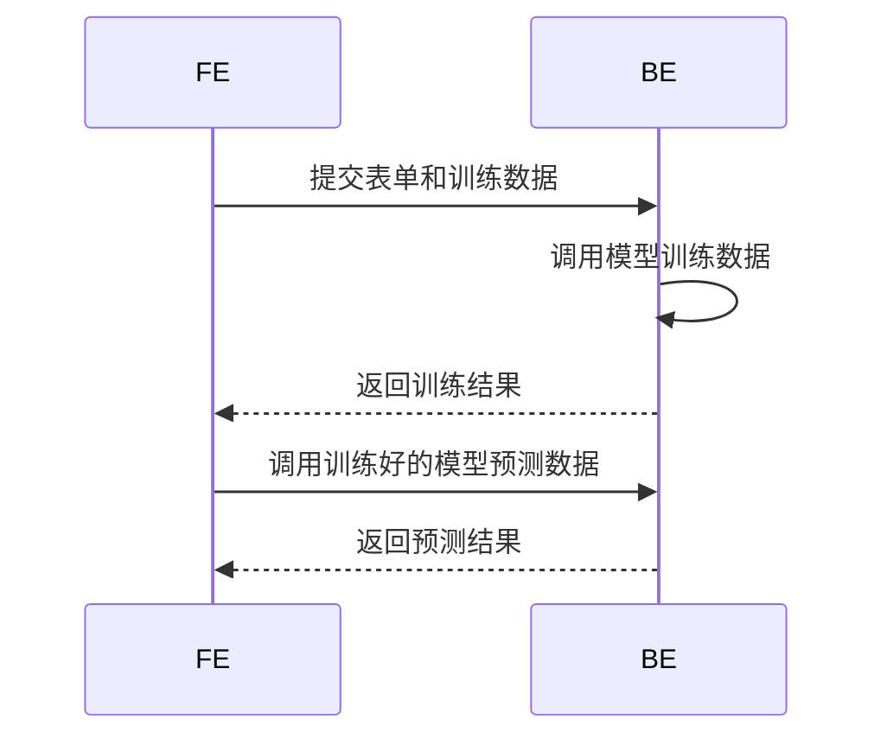

---
{"dg-publish":true,"dg-permalink":"projects/oilPlantform","permalink":"/projects/oilPlantform/"}
---

# 简介

石油方面在线用自己的数据训练模型并调用。获取 **山东省软件设计大赛三等奖**。

## 使用的技术

#Django #Scikit-learn 

## 遇到的问题和解决办法

1. 后端的 **matplotlib** 画出的图太复杂不好返回给前端。简单的图可以用Echarts拿数据在前端展示，复杂的图直接保存成图片放到后端。
2. 训练模型阻塞进程导致前端长时间等待。

## 改进方案

1. 后端和训练的服务器分离，通过消息队列异步调用
2. 给好用的模型做统计和推荐