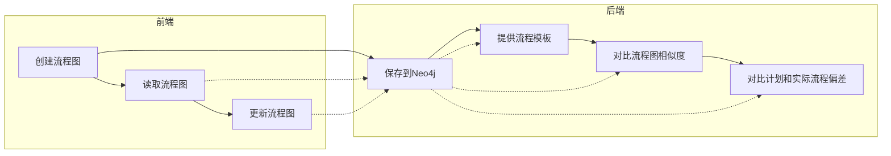
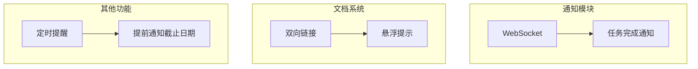

---
{"dg-publish":true,"dg-permalink":"projects/ProjectFlowsTrunc","permalink":"/projects/ProjectFlowsTrunc/"}
---

# 简介V1

多人在线协作流程管理，项目流程进度的可视化。

## 使用的技术

#Django #MySQL #Echarts #Bootstrap
## 已有功能

- 用户
    - 邮箱注册，验证激活
    - 修改头像、名称
    - 搜索用户
    - 登入
    - 退出
- 通知
    - 成员
        - 紧急任务
        - 开始任务
    - 管理员
        - 成员完成任务
- 关系图
    - 任务节点
        - 结点增删改查
        - 节点分配
        - 标记紧急任务
        - 标记完成任务
        - **任务指下层向其他节点**
    - 任务图
        - 增删改查
- 主面板
    - 管理参与的项目
    - 工单：完成未完成的任务

## 部署

Nginx+uwsgi+Djagno

## 待改进

1. **通知改为WebSocket**
2. **添加更换任务负责人的通知**
3. 添加任务图更改日志
4. **参考Git图而不是现在的类树状图（不能跨层链接）**
5. **图中添加时间线**
6. **任务是别人的前缀时可以提交Markdown提醒和模板**
7. 使用图数据库
8. 任务节点设置截止日期，临近日期发送警报
9. 待完成任务随机按钮
10. 集成Git
11. 前端任务展示不友好只有表格加图
12. 个人页面任务完成分析
13. 加入白板插件Excalidraw

## 人物的整体走向取决于管理员，不是所有的管理员都有明确的整体计划

~~1. **增加成员之间新建任务点处理突发情况**~~

## 增加异常报备和任务分配

比如测试-->管理员（分配）-->成员

# 简介V2

添加了文档管理和定时通知功能, 重构了任务节点存储功能。

## 技术

#Django #Neo4j #WebSoceket #Echarts #Redis #Celery